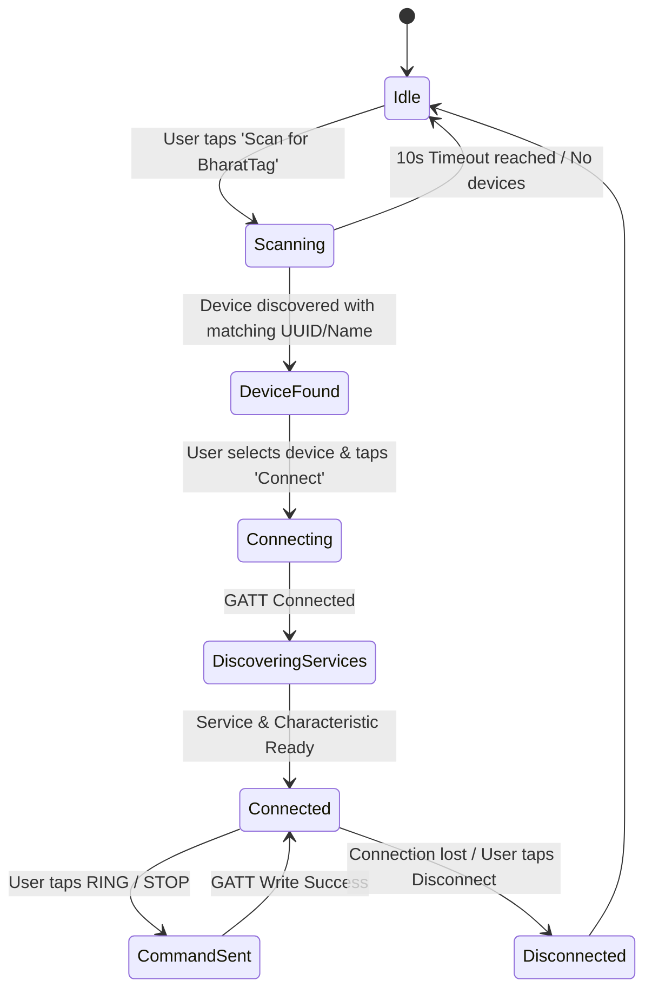

# BharatTag Codebase Technical Overview & Architectural Documentation

This document provides a comprehensive technical overview of the **BharatTag** Android application codebase, detailing the architecture, component relationships, state management, BLE communication flows, UI components, and build configurations.

---

## 📐 Architecture Overview

BharatTag follows modern Android development best practices utilizing **Jetpack Compose** for declarative UI, **Unidirectional Data Flow (UDF)** with **MVVM (Model-View-ViewModel)** architecture, and **Kotlin Coroutines / Flows** for asynchronous event and state streams.

### High-Level Architecture Diagram

```mermaid
graph TD
    subgraph UI Layer [UI Layer (Jetpack Compose)]
        MA[MainActivity.kt] --> BTS[BharatTagScreen.kt]
        BTS --> SB[StatusBanner.kt]
        BTS --> TC[TrackerCard.kt]
        BTS --> CCS[CommandControlsSection.kt]
        BTS --> DLS[DeviceListSection.kt]
        BTS --> LCS[LogConsoleSection.kt]
    end

    subgraph State & Logic Layer [ViewModel & State Layer]
        VM[BharatTagViewModel.kt] <--> US[BharatTagUiState]
        VM <--> CS[BleConnectionState]
    end

    subgraph Core BLE Service [BLE Management Layer]
        BM[BharatTagBleManager.kt] <--> GATT[BluetoothGatt / GATT Callbacks]
        BM <--> SCAN[BluetoothLeScanner]
        BM <--> BR[BroadcastReceiver (Adapter State)]
    end

    subgraph Hardware Layer [Physical Hardware]
        GATT <-->|BLE GATT Services & Characteristics| ARD[Arduino UNO R4 WiFi + Buzzer]
    end

    BTS -->|Observes UiState / Triggers Actions| VM
    VM -->|Controls Scan, Connect, Commands| BM
    BM -->|Emits BleEvents & State Flow| VM
```

---

## 📁 File & Package Structure

```text
app/src/main/
├── AndroidManifest.xml                        # Manifest declaring BLE hardware & runtime permissions
└── java/com/example/
    ├── MainActivity.kt                        # App entry point, activity lifecycle & permission launcher
    ├── ble/
    │   └── BharatTagBleManager.kt             # Native Android BLE GATT scanner, connection & command manager
    ├── model/
    │   ├── BleDeviceItem.kt                   # Data model for discovered/selected BLE devices & metadata
    │   └── UiState.kt                         # UI state data structures & BleConnectionState sealed interface
    ├── ui/
    │   ├── BharatTagScreen.kt                 # Main screen layout, scaffold, top bar & permission dialogs
    │   ├── components/
    │   │   ├── CommandControlsSection.kt      # RING, STOP & Disconnect control action buttons
    │   │   ├── DeviceListSection.kt           # Device scan progress bar, list & device selection cards
    │   │   ├── LogConsoleSection.kt           # Collapsible live terminal console for BLE activity logs
    │   │   ├── StatusBanner.kt                # Adapter status, permission warnings & settings navigation
    │   │   └── TrackerCard.kt                 # Hero item card with radar pulse, connection status & RSSI
    │   └── theme/
    │       ├── Color.kt                       # Material 3 & custom brand color tokens
    │       ├── Theme.kt                       # Light/Dark MaterialTheme configuration
    │       └── Type.kt                        # Typography scale definitions
    └── viewmodel/
        └── BharatTagViewModel.kt              # Central ViewModel bridging BLE manager events to Compose UI state
```

---

## 🛠️ Detailed Component & Class Breakdown

### 1. `MainActivity.kt`
- **Location**: [`app/src/main/java/com/example/MainActivity.kt`](file:///C:/Users/abhin/OneDrive/Documents/bharattag/app/src/main/java/com/example/MainActivity.kt)
- **Role**: Entry point `ComponentActivity` for the application.
- **Key Responsibilities**:
  - Sets up edge-to-edge layout display (`enableEdgeToEdge()`).
  - Instantiates `BharatTagViewModel` scoped to the activity.
  - Handles runtime permission checking on launch and return (`onResume`).
  - Provides system fallback intent handlers to open Bluetooth settings directly (`openBluetoothSettings()`).
  - Houses `MainContent` composable with `rememberLauncherForActivityResult` for multi-permission requests.

---

### 2. `BharatTagBleManager.kt`
- **Location**: [`app/src/main/java/com/example/ble/BharatTagBleManager.kt`](file:///C:/Users/abhin/OneDrive/Documents/bharattag/app/src/main/java/com/example/ble/BharatTagBleManager.kt)
- **Role**: Encapsulates native Android BLE operations using `BluetoothLeScanner`, `BluetoothGatt`, and `BluetoothGattCallback`.
- **Constants**:
  - `SERVICE_UUID`: `19B10000-E8F2-537E-4F6C-D104768A1214`
  - `COMMAND_CHARACTERISTIC_UUID`: `19B10001-E8F2-537E-4F6C-D104768A1214`
  - `TARGET_DEVICE_NAME`: `"BharatTag"`
  - `SCAN_DURATION_MS`: `10_000L` (10 seconds timeout)
  - `WRITE_TIMEOUT_MS`: `4_000L` (4 seconds write safeguard)
  - `CMD_RING`: `"RING"`
  - `CMD_STOP`: `"STOP"`
- **Exposed State Flows & Event Streams**:
  - `isScanning`: `StateFlow<Boolean>`
  - `scanRemainingSeconds`: `StateFlow<Int>`
  - `discoveredDevices`: `StateFlow<List<BleDeviceItem>>`
  - `connectedDevice`: `StateFlow<BleDeviceItem?>`
  - `isCharacteristicReady`: `StateFlow<Boolean>`
  - `isWriteInProgress`: `StateFlow<Boolean>`
  - `events`: `SharedFlow<BleEvent>` emitting discrete events (`ScanStarted`, `DeviceDiscovered`, `Connected`, `WriteSuccess`, etc.)
- **Core Operations**:
  - `startScan()`: Starts filtered BLE scanning for `SERVICE_UUID` and `"BharatTag"` with a 10s countdown timer.
  - `stopScan()`: Stops scanner cleanly and resets countdown jobs.
  - `connect(item)`: Initiates GATT connection with `TRANSPORT_LE`.
  - `gattCallback`: Manages connection state changes, service discovery (`discoverServices()`), characteristic write verification, and disconnection handling.
  - `sendCommand(command)`: Validates allowed commands (`"RING"` / `"STOP"`), sets characteristic payload, handles Android 13+ (`Tiramisu`) vs legacy GATT write APIs, and runs a write timeout safety job.
  - `registerBluetoothStateReceiver()`: Monitors system Bluetooth adapter ON/OFF state via `BroadcastReceiver`.

---

### 3. `BharatTagViewModel.kt`
- **Location**: [`app/src/main/java/com/example/viewmodel/BharatTagViewModel.kt`](file:///C:/Users/abhin/OneDrive/Documents/bharattag/app/src/main/java/com/example/viewmodel/BharatTagViewModel.kt)
- **Role**: `AndroidViewModel` maintaining immutable state updates and mapping BLE events to user-visible state and activity logs.
- **Key Logic**:
  - Exposes `uiState: StateFlow<BharatTagUiState>`.
  - Determines required permissions depending on API level:
    - Android 12+ (API 31+): `BLUETOOTH_SCAN`, `BLUETOOTH_CONNECT`.
    - Android 11 & older: `BLUETOOTH`, `BLUETOOTH_ADMIN`, `ACCESS_FINE_LOCATION`.
  - Collects state and events from `BharatTagBleManager` using `viewModelScope`.
  - Appends logs (`LogEntry`) with timestamps and status indicators (success/error).
  - Handles user interactions: `startScan()`, `stopScan()`, `selectDevice()`, `connect()`, `disconnect()`, `sendRingCommand()`, `sendStopCommand()`, `clearLogs()`.

---

### 4. Data Models (`UiState.kt` & `BleDeviceItem.kt`)
- **Location**: [`app/src/main/java/com/example/model/`](file:///C:/Users/abhin/OneDrive/Documents/bharattag/app/src/main/java/com/example/model/)
- **`BleConnectionState`**: Sealed interface representing connection phases:
  - `BluetoothUnavailable`, `BluetoothDisabled`, `PermissionRequired`, `Idle`, `Scanning`, `DeviceFound`, `Connecting`, `DiscoveringServices`, `Connected`, `Disconnected`, `Error`.
- **`BharatTagUiState`**: Data class encapsulating:
  - Connection state, scan status, discovered device list, selected device, connected device, write progress, status messages, and log history.
- **`BleDeviceItem`**: Data model wrapping `BluetoothDevice` with metadata (`name`, `address`, `rssi`, `isBharatTagNamed`, `hasBharatTagServiceUuid`).
- **`LogEntry`**: Timestamped entry containing message text and error/success flag colors.

---

### 5. UI Layer Components

#### `BharatTagScreen.kt`
- **Location**: [`app/src/main/java/com/example/ui/BharatTagScreen.kt`](file:///C:/Users/abhin/OneDrive/Documents/bharattag/app/src/main/java/com/example/ui/BharatTagScreen.kt)
- Root screen scaffold with TopAppBar, title badges, refresh & permissions info buttons, SnackbarHost for transient feedback, and scrollable content area hosting all main sections.

#### `StatusBanner.kt`
- **Location**: [`app/src/main/java/com/example/ui/components/StatusBanner.kt`](file:///C:/Users/abhin/OneDrive/Documents/bharattag/app/src/main/java/com/example/ui/components/StatusBanner.kt)
- Contextual header banner reflecting real-time connection/bluetooth state with animated background color changes, loading indicators, and action buttons ("Open Bluetooth Settings" / "Grant Permissions").

#### `TrackerCard.kt`
- **Location**: [`app/src/main/java/com/example/ui/components/TrackerCard.kt`](file:///C:/Users/abhin/OneDrive/Documents/bharattag/app/src/main/java/com/example/ui/components/TrackerCard.kt)
- Hero card featuring an animated radar pulse when connected, device title, status pill ("CONNECTED & READY"), MAC address, and signal strength RSSI dBm readout.

#### `CommandControlsSection.kt`
- **Location**: [`app/src/main/java/com/example/ui/components/CommandControlsSection.kt`](file:///C:/Users/abhin/OneDrive/Documents/bharattag/app/src/main/java/com/example/ui/components/CommandControlsSection.kt)
- Control section containing prominent **RING** (Orange) and **STOP** (Red) buttons, progress indicators during writes, and a **Disconnect** button when connected.

#### `DeviceListSection.kt`
- **Location**: [`app/src/main/java/com/example/ui/components/DeviceListSection.kt`](file:///C:/Users/abhin/OneDrive/Documents/bharattag/app/src/main/java/com/example/ui/components/DeviceListSection.kt)
- Displays nearby scanned BLE devices, scan trigger button, 10s progress indicator, recommendation badges ("Verified BharatTag"), selection radio state, and connect button.

#### `LogConsoleSection.kt`
- **Location**: [`app/src/main/java/com/example/ui/components/LogConsoleSection.kt`](file:///C:/Users/abhin/OneDrive/Documents/bharattag/app/src/main/java/com/example/ui/components/LogConsoleSection.kt)
- Collapsible live terminal log view listing up to 50 timestamped BLE activity messages with color-coded severity indicators.

---

## 📡 BLE Protocol & Payload Specification

| Attribute | Value | Description |
|---|---|---|
| **Service UUID** | `19B10000-E8F2-537E-4F6C-D104768A1214` | Primary BharatTag GATT Service |
| **Command Characteristic UUID** | `19B10001-E8F2-537E-4F6C-D104768A1214` | Writable String Characteristic |
| **Target Device Name** | `BharatTag` | Advertised local device name |
| **RING Command Payload** | `"RING"` (UTF-8 bytes) | Triggers 2000Hz tone on Arduino pin D8 |
| **STOP Command Payload** | `"STOP"` (UTF-8 bytes) | Silences buzzer immediately |

---

## 🔄 Lifecycle & State Transitions



---

## ⚙️ Build & Configuration Metadata

- **Gradle Plugins**:
  - `com.android.application`
  - `org.jetbrains.kotlin.plugin.compose`
  - `com.google.devtools.ksp`
  - `com.google.android.libraries.mapsplatform.secrets-gradle-plugin`
  - `com.google.gms.google-services`
- **SDK Targets**:
  - `compileSdk = 36`
  - `minSdk = 24` (Android 7.0+)
  - `targetSdk = 36` (Android 16)
- **Key Dependencies**:
  - Jetpack Compose (BOM) & Material 3
  - AndroidX Core KTX, Lifecycle KTX, ViewModel Compose
  - Kotlinx Coroutines (Android & Core)
